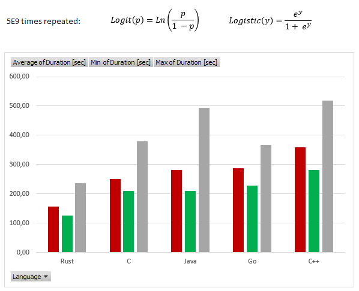

# Logit Challenge

First, generate test data of reasonable size and then start various test clients to test speed.

## Generate Test Data

RUST GEN
RUST
```cmd
cargo build
target\debug\logit_datagen.exe 5000 1000000 > ..\logit_data.txt
```

First parameter: How many times will should be the test set repeated during the test. Please note that the computers are pretty fast, so even 1000000 records will be evaluated in fraction of second.

Second parameter: Size of the sample.

## Execute Tests

C

```cmd
gcc -Wall -lm -o main main.c
./main.exe  < ../logit_data.txt
```

C++

```cmd
g++ -Wall -lm -o main main.cpp
./main.exe < ../logit_data.txt
```

Java

```cmd
javac Main.java
java Main < ..\logit_data.txt
```

Go

```cmd
go build main.go
./main.exe < ../logit_data.txt
```

RUST

```cmd
cargo build
target\debug\logit_test_rust.exe < ..\logit_data.txt
```

## Results



[Excel](logit_results.xlsx)


## Resources

[Logit Wiki](https://en.wikipedia.org/wiki/Logit)
