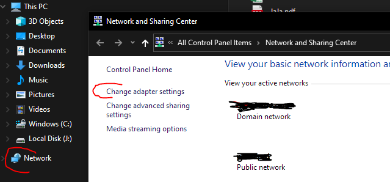
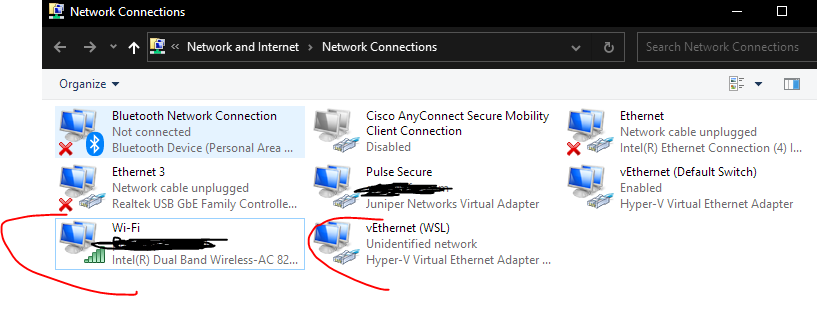
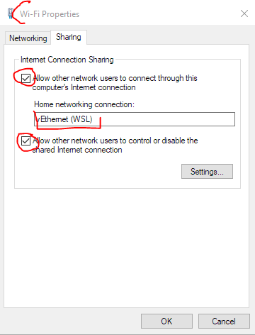
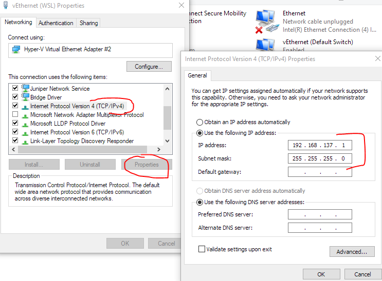

# Resolving WSL2 DNS Issue

The goal was to setup Docker in WSL2 Linux. During the setup, several issue with network access generated a lot of effort connected with the investigation. The same machine converted to WSL1 worked without problem but after converting to wsl2, networking and esp. DNS stopped working.

The main problem was missing sharing of the networ adapter in Windows.

## Install wsl to Windows

See which distributions can be installed:

```cmd
C:\Users\test>wsl --list --online
The following is a list of valid distributions that can be installed.
Install using 'wsl --install -d <Distro>'.

NAME            FRIENDLY NAME
Ubuntu          Ubuntu
Debian          Debian GNU/Linux
...
```

Install you favourite distribution.

```cmd
C:\Users\test>wsl --install -d debian
```

Check the status of the distributio.

```cmd
C:\Users\test>wsl -l -v
  NAME      STATE           VERSION
* Debian    Running         2
```

Open the distribuion from Windows start menu or e.g. from Windows Terminal (available in Windows store and recommended). Check if ping to the Internet works and you can e.g. update apt. If so, you are done and you can ignore following steps.

## Troubleshoot the DNS issue with WSL2

### Idea Behind

Route all traffic from Linux to the virtual adapter and use this adapter as default gateway. Windows will do NAT (or some internal mechanism) and direct the traffic to the outside Internet.

### Windows Setup

In Windows Explorer (you can start it by pressing Win+e), right click on "Network" and select "Properties", then click on "Change adapter settings".



Among others, you shall see you primary network interface which is connected (Wi-Fi in the case below).

There is also the WSL virtual adapter vEthernet (WSL).



Right click on your main adapter (in our case "Wi-Fi"), select "Sharing". Select both check boxes and select the WSL virtual adapter. Confirm and close the window.



Right click on your virtual WSL adapter (in our case "vEthernet (WSL)"), select "Networking". Select "Internet Protocol Version 4" and click "Propoerties". Note the IP address and netmask provided. Change nothing and just close the windows.



### Linux Setup

The setup will be done for the eth0 interface.

Start console as root:

```cmd
root@testvm:/home/test# sudo su
```

#### Basic Setup - IP, Routing

List all set IP addresses:

```cmd
root@testvm:/home/test# ip addr
...
4: eth0: <BROADCAST,MULTICAST,UP,LOWER_UP> mtu 1500 qdisc mq state UP group default qlen 1000
    link/ether 00:15:5d:ed:32:4f brd ff:ff:ff:ff:ff:ff
    inet 172.18.19.45/20 brd 172.18.31.255 scope global eth0
       valid_lft forever preferred_lft forever
    inet6 fe80::215:5dff:feed:324f/64 scope link
       valid_lft forever preferred_lft forever
...
```

Delete the old IP addresses:

```cmd
root@testvm:/home/test# ip addr del 172.18.19.45/20 dev eth0
```

Assign new IP address from the same range as the virtual adapter has (the address has to be dofferent from the address of the virtual adapter, it just has to be in the same segment)!

```cmd
root@testvm:/home/test# ip addr add 192.168.137.2/24 dev eth0
```

Now set the default route via the virtual adapter:

```cmd
root@testvm:/home/test# ip route add default via 192.168.137.1
```

You shall now be able to ping the virtual adater, you router interface and even e.g. Google dns server.

```cmd
root@testvm:/home/test# ping -c 1 192.168.137.1
PING 192.168.137.1 (192.168.137.1) 56(84) bytes of data.
64 bytes from 192.168.137.1: icmp_seq=1 ttl=128 time=0.512 ms
--- 192.168.137.1 ping statistics ---
1 packets transmitted, 1 received, 0% packet loss, time 0ms
rtt min/avg/max/mdev = 0.512/0.512/0.512/0.000 ms

root@testvm:/home/test# ping -c 1 192.168.1.1
PING 192.168.1.1 (192.168.1.1) 56(84) bytes of data.
64 bytes from 192.168.1.1: icmp_seq=1 ttl=63 time=10.3 ms
--- 192.168.1.1 ping statistics ---
1 packets transmitted, 1 received, 0% packet loss, time 0ms
rtt min/avg/max/mdev = 10.369/10.369/10.369/0.000 ms

root@testvm:/home/test# ping -c 1 8.8.8.8
PING 8.8.8.8 (8.8.8.8) 56(84) bytes of data.
64 bytes from 8.8.8.8: icmp_seq=1 ttl=116 time=36.1 ms
--- 8.8.8.8 ping statistics ---
1 packets transmitted, 1 received, 0% packet loss, time 0ms
rtt min/avg/max/mdev = 36.191/36.191/36.191/0.000 ms
```

#### DNS Setup

First, we need to tell wsl not to generate resolv.conf file and make it static. Create /etc/wsl.conf with the following content:

root@testvm:/home/test# cat /etc/wsl.conf
[network]
generateResolvConf = false

Manually add the DNS servers as you wish. Create or edit the /etc/resolv.conf file:

root@testvm:/home/test# cat /etc/resolv.conf
nameserver 192.168.1.1
nameserver 8.8.8.8

Networking shall be fully working now.

## Installing Docker

Please see links below. There is very good guideline directly from Docker.

## Potential Issues

There is currently no way to set the static IP address and routing permanently.; So after reboot, you may need to change the IP and routing.

## Open Topics

Assign static IP to the Linux.

## Links

[Sharing VPN, Internet host networks with Hyper-V Ubuntu on Windows 10](https://darrmirr.medium.com/sharing-vpn-internet-host-networks-with-hyper-v-ubuntu-on-windows-10-c82629d31f3b)

[Install Docker Engine on Debian](https://docs.docker.com/engine/install/debian/)
